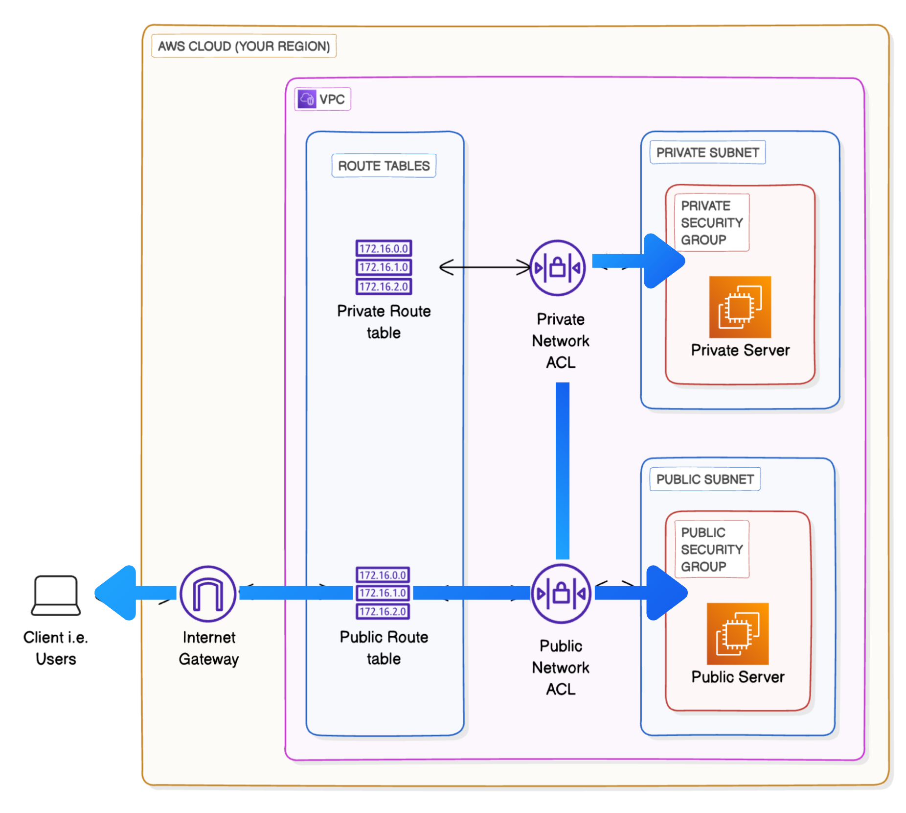
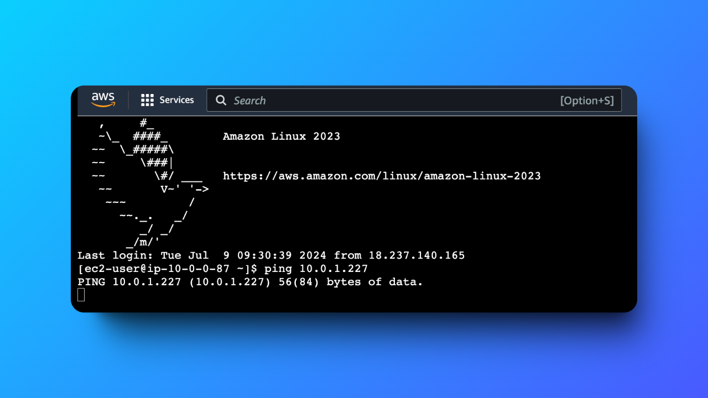
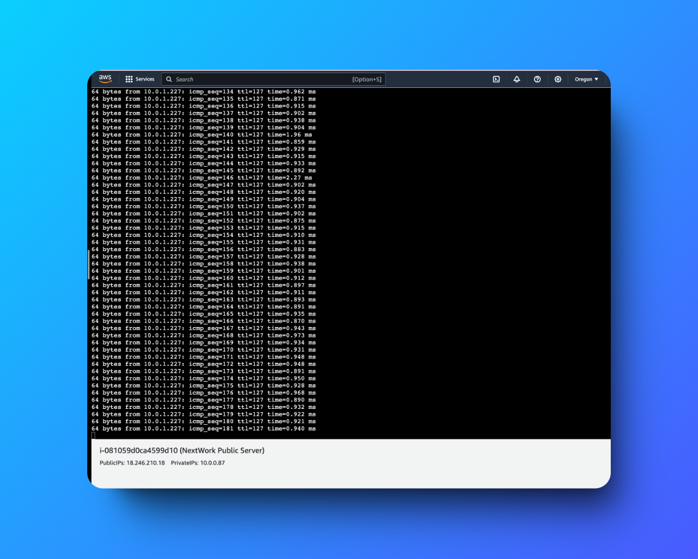

# Testing Amazon VPC Connectivity 🔒

---

## Overview

This project demonstrates the use of **Amazon Virtual Private Cloud (VPC)** to set up isolated subnets for public and private servers, configure **Security Groups** and **Network Access Control Lists (NACLs)**, and manage routing for controlling traffic flow. The goal was to ensure secure communication and establish a well-structured network for efficient connectivity.

---

## Table of Contents

1. [What is Amazon VPC?](#what-is-amazon-vpc)
2. [Project Overview](#project-overview)
3. [How Amazon VPC Was Used](#how-amazon-vpc-was-used)
4. [Unexpected Challenges](#unexpected-challenges)
5. [Connectivity Testing](#connectivity-testing)
6. [Troubleshooting Connectivity](#troubleshooting-connectivity)
7. [Connectivity to the Internet](#connectivity-to-the-internet)
8. [Best Practices](#best-practices)
9. [Community and Acknowledgment](#community-and-acknowledgment)
10. [Author](#author)

---

## What is Amazon VPC?

Amazon VPC allows you to create isolated virtual networks within the AWS cloud. It provides control over network configuration, security, and traffic routing, making it an ideal solution for setting up secure, scalable, and customizable infrastructure in the cloud.

---

## Project Overview

In this project, I used Amazon VPC to manage network connectivity and security for two servers: a **public server** and a **private server**. The key objective was to ensure that these servers could communicate securely, using well-defined networking components such as route tables, security groups, and NACLs.

  
*Figure: High-level architecture of the VPC setup, showcasing public and private subnets, routing tables, and an internet gateway.*

---

## How Amazon VPC Was Used

- **Subnets**: Created isolated subnets for the public and private servers.
- **Security Groups**: Configured to control traffic between the servers and externally.
- **Network ACLs**: Used to apply additional traffic controls for each subnet.
- **Routing**: Configured to manage traffic flow between servers and the internet.

---

## Unexpected Challenges

One challenge I didn’t expect was the amount of time troubleshooting network issues between the public and private subnets, particularly when it came to configuring security groups and NACLs to allow proper **ICMP traffic**. This took more time than anticipated.

---

## Connectivity Testing

The first connectivity test I performed was to check if I could connect to the **NextWork public server** in the **NextWork public subnet** using **EC2 Instance Connect** (SSH).

  
*Figure: Initial failed ping request highlighting the connectivity issue.*

---

## Troubleshooting Connectivity

During testing, I encountered an issue where I couldn't access the server due to missing inbound SSH rules in the **NextWork Public Security Group**. After adding the rule to allow SSH traffic on port 22, I successfully accessed the EC2 instance.

I also tested connectivity between the **public** and **private** servers using the `ping` command. Initially, the ping request from the public server to the private server showed successful transmission but no response. I then added the necessary **ICMP IPv4 rules** to both the **NextWork NACL** and the **Private Security Group** to resolve the issue.

  
*Figure: Successful ping request showing responses from the private server.*

---

## Connectivity to the Internet

To verify internet connectivity, I used the **curl** command to send HTTP requests from the public server to the **NextWork website**. The command `curl https://learn.nextwork.org/projects/aws-host-awebsite-on-s3` returned the HTML content, confirming that the server had proper internet access.

---

## Best Practices

- Always define **inbound and outbound rules** clearly in **Security Groups**.
- Use both **NACLs** and **Security Groups** for a multi-layered security approach.
- Thoroughly test connectivity using tools like **ping** and **curl** to ensure network configurations are correct.
- Keep detailed records of network configurations to assist with troubleshooting.

---

## Community and Acknowledgment
Special thanks to [NextWork Community](https://link.nextwork.org/app?utm_source=app&utm_medium=nav&utm_campaign=referral) and **Natasha Ong** ([LinkedIn](https://www.linkedin.com/in/natasha-ong)) for their valuable guidance and insights.

---

## Author

**Hassan Gachoka**  
[LinkedIn](https://linkedin.com/in/gachokahassan)
